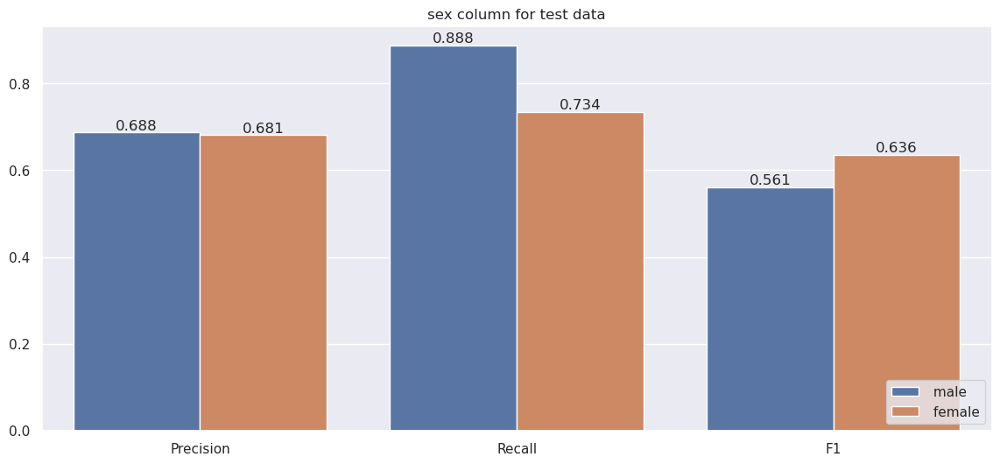
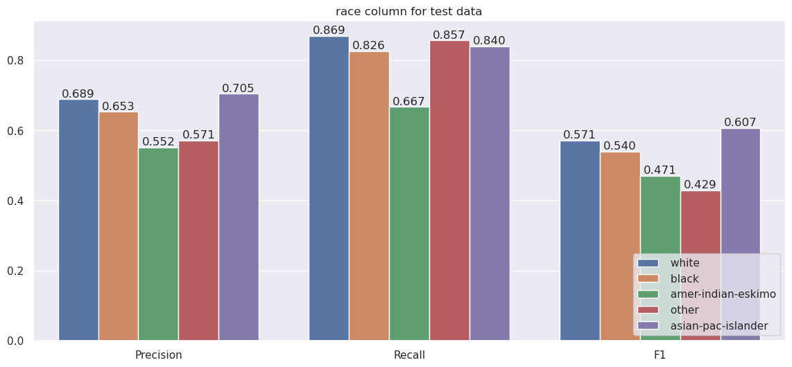

# Model Card

  
## Model Details
- Prediction is whether employer's  income exceeds $50K/year.
- **Random Forest** , only **Random Forest** is used.

## Intended Use
- Finding features impacts the income of a person.
- Detect underprivileged employers.

## Factors
 - Ascess factors underprivileged such as gender, race, etc.
 
## Training Data
- Census Income [Dataset](https://archive.ics.uci.edu/ml/datasets/census+income) from UCI
- Categorical data:
  - Handled missing values by imputing the data using `SimpleImputer` with the most frequent value
  - Encoded the categories using `LabelEncoder` and setting a value of 1000 for unknown categories
- Numerical data:
  - Normalized the numerical data using `StandardScaler`

## Evaluation Data
- Split the train data using sklearn `train_test_split` with a fixed `random_state=17` and stratified on `salary label`.
  
## Metrics
-  **Precision**, **Recall** and **F1 score** are used.
- These 3 metrics can be calculated from the confusion matrix for binary classification which are more suitable for imbalanced problems.
- Precision: Ratio between correct predictions and the total predictions
- Recall: Ratio of the correct predictions and the total number of correct items in the set
- F1: Harmoinc mean between Precision and Recall to show the balance between them.

## Caveats and Recommendations
- The data was collected in 1996 which does not reflect insights from the modern world.
- Features with minor categories should be focused more when collecting extra data.

## Quantitative Analyses
All results shown are calculated for class 1 (>50K) using sklearn metrics
|				|Train |Test   |
|---------------|------|-------|
|Precision		|0.72 |0.68  |
|Recall         |0.89 |0.87  |
|F1          	|0.61 |0.63  |

